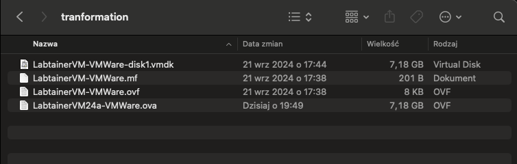

# Running Labtainer on MacBook Pro M3 using UTM

This guide explains how to set up and run **Labtainer**, a Linux-based cybersecurity lab environment, on a MacBook Pro M3 using **UTM**. Labtainer is typically not available for ARM, so this setup involves emulating an x86 environment. Thanks to this guide, NPS has officially provided a QCOW2 image, allowing users to skip several setup steps.

---

## Table of Contents
1. [Overview of Tools and File Formats](#overview-of-tools-and-file-formats)
   - [What is an OVA file?](#what-is-an-ova-file)
   - [What is QCOW2?](#what-is-qcow2)
2. [Using the Official QCOW2 Image](#using-the-official-qcow2-image)
   - [Step 1: Download the QCOW2 Image](#step-1-download-the-qcow2-image)
   - [Step 2: Unzip and Configure in UTM](#step-2-unzip-and-configure-in-utm)
3. [Preparing the Labtainer Image Manually](#preparing-the-labtainer-image-manually)
   - [Step 1: Download UTM](#step-1-download-utm)
   - [Step 2: Download Labtainer OVA File](#step-2-download-labtainer-ova-file)
   - [Step 3: Install QEMU via Homebrew](#step-3-install-qemu-via-homebrew)
   - [Step 4: Convert OVA to QCOW2 Format](#step-4-convert-ova-to-qcow2-format)
4. [Setting Up the Virtual Machine in UTM](#setting-up-the-virtual-machine-in-utm)
   - [Step 5: Create a New Virtual Machine in UTM](#step-5-create-a-new-virtual-machine-in-utm)
   - [Step 6: Configure the VM Settings](#step-6-configure-the-vm-settings)
   - [Step 7: Boot and Test the VM](#step-7-boot-and-test-the-vm)
5. [Demo Video](#demo-video)
6. [Additional Notes](#additional-notes)

---

## Overview of Tools and File Formats

### What is an OVA file?
An **OVA** (Open Virtualization Archive) file is a standardized file format that packages all components of a virtual machine into a single file, making it easy to share and distribute VMs. OVA files can contain the VM disk image (usually in VMDK format), configuration files, and metadata.

### What is QCOW2?
**QCOW2** (QEMU Copy-On-Write version 2) is a disk image format used by QEMU. It supports advanced features such as snapshots, compression, and encryption, ideal for use in virtualized environments like UTM.

---

## Using the Official QCOW2 Image

### Step 1: Download the QCOW2 Image
NPS now provides an official QCOW2 image for Labtainer based on the original instructions in this guide. This image is pre-configured for use with UTM, allowing you to skip steps 2, 3, and 4 of the manual setup.

- [Official QCOW2 Image for Labtainer on Mac](https://nps.edu/web/c3o/virtual-machine-images)

### Step 2: Unzip and Configure in UTM
After downloading the QCOW2 image:
1. **Unzip the file**.
2. **Open UTM**, select **Import Drive** during VM setup, and choose the unzipped QCOW2 file.

For additional help with this setup, watch this [YouTube tutorial](https://youtu.be/ckBRtSlhcww) on importing QCOW2 images into UTM.

---

## Preparing the Labtainer Image Manually

If you prefer a manual setup or for learning purposes, you can prepare the image yourself by following these steps.

### Step 1: Download UTM
UTM is a virtual machine manager for macOS that supports running VMs on both x86_64 and ARM-based Macs. Download the latest version of UTM for macOS from GitHub:

- [UTM Download Link](https://github.com/utmapp/UTM/releases/latest/download/UTM.dmg)

After downloading, open the `.dmg` file and install UTM by dragging it to your Applications folder.

### Step 2: Download Labtainer OVA File
Labtainer is distributed as an OVA file. Download the pre-configured Labtainer OVA image for VMware:

- [Labtainer OVA Download Link](https://nps.box.com/shared/static/2582mm4x58mn6rqy049no0bspj5vdmqv.ova)

### Step 3: Install QEMU via Homebrew
To convert the OVA file to a QCOW2 format compatible with UTM, we’ll need **QEMU**, a free and open-source emulator. Install QEMU via Homebrew:

```bash
brew install qemu
```

> **Note**: Homebrew is a package manager for macOS. If you don’t have it installed, follow the instructions on [Homebrew’s website](https://brew.sh).

### Step 4: Convert OVA to QCOW2 Format
The OVA file is essentially a compressed archive. To extract it, use the following command in your terminal:

```bash
tar -xvf LabtainerVM24a-VMWare.ova
```


After extracting, you should see several files, including a `.vmdk` file (the virtual disk for VMware). We will convert this `.vmdk` file to the QCOW2 format:

```bash
qemu-img convert -O qcow2 LabtainerVM-VMWare-disk1.vmdk labtainer-utm-vm.qcow2
```

This command creates a file called `labtainer-utm-vm.qcow2`, which is compatible with UTM.

---

## Setting Up the Virtual Machine in UTM

### Step 5: Create a New Virtual Machine in UTM
1. Open **UTM** and click the **+** button to create a new virtual machine.
2. Select **Virtualize** to create a virtual machine with x86_64 emulation.

### Step 6: Configure the VM Settings

For my setup on a MacBook Pro M3 with 36 GB of RAM, I used the following configuration:

1. **System**:
   - **Architecture**: Set to **x86_64** (even though your Mac is ARM, UTM can emulate x86).
   - **CPU Cores**: Set to **4 cores**.
   - **Multithreading**: Enabled (recommended to improve performance).
   - **Boot Options**: Disable **UEFI Boot** (uncheck this option).

2. **Memory**: Allocate **8 GB of RAM** for the virtual machine. If you have less RAM, you may need to adjust this, but 8 GB is recommended for stable performance in Labtainers.

3. **Drive**: Select **Import Drive** and choose the `labtainer-utm-vm.qcow2` file you converted earlier.

4. **Display**:
   - **Graphics Card**: Select **virtio-gpu-gl-pci (GPU Supported)** to enable better graphical performance.
   - **SPICE**: Ensure **SPICE** is selected if you need enhanced display options, such as clipboard sharing.

### Step 7: Boot and Test the VM
1. Start the VM in UTM.
2. Once the VM boots, log in and check that Labtainers is operational.

> **Additional Resources**: For a visual guide on how to import a QCOW2 image into UTM, you may find this [YouTube tutorial](https://www.youtube.com/watch?v=enF3zbyiNZA) helpful.

---

## Demo Video

For a complete walkthrough on setting up Labtainer with UTM, check out this [YouTube video](https://www.youtube.com/watch?v=Dh6Hlbu53O0), which demonstrates running Labtainer on a MacBook Pro M3.

---

## Additional Notes

- **Performance**: Running x86 emulation on ARM can be demanding on system resources. You may need to experiment with CPU and memory allocations for optimal performance.
- **Troubleshooting**: If you encounter issues, check the UTM and QEMU documentation, or consult online forums for specific configuration tips.
